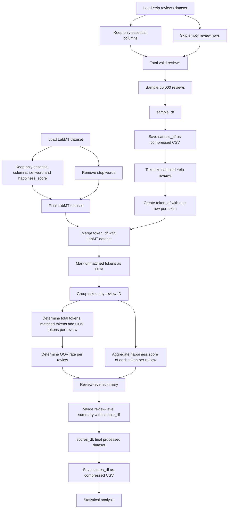
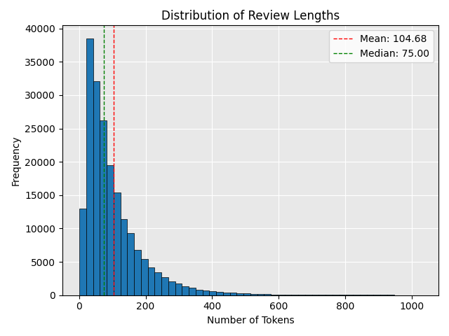
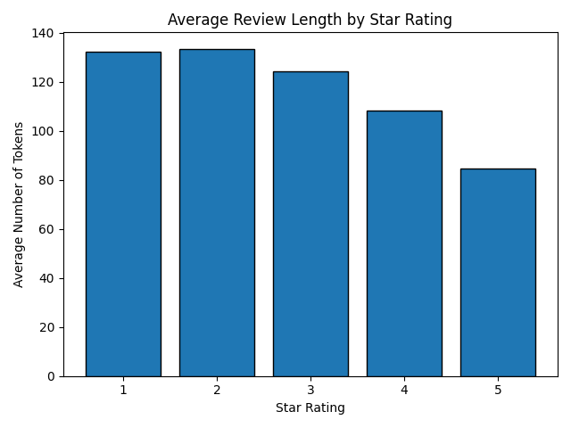
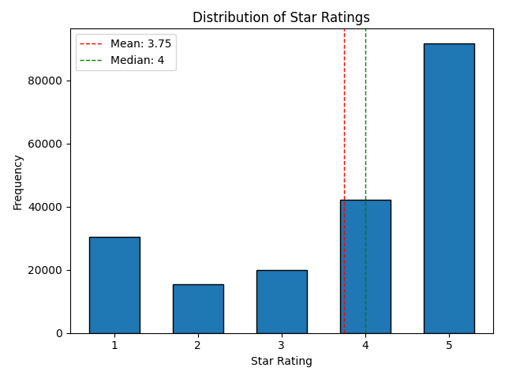
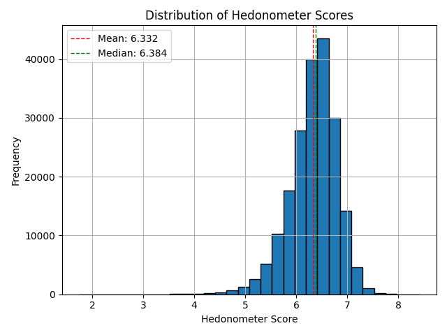
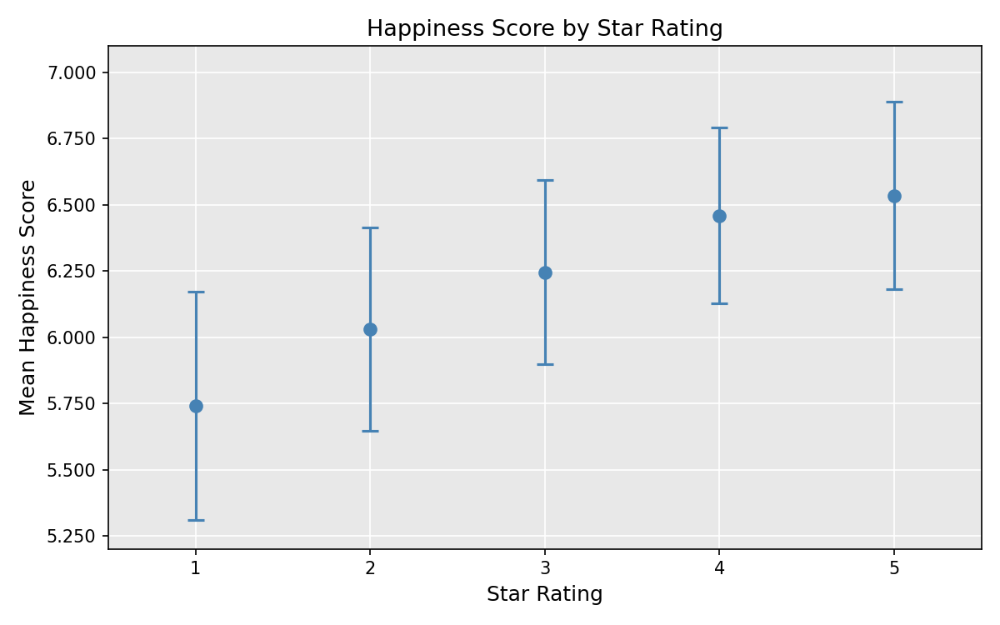
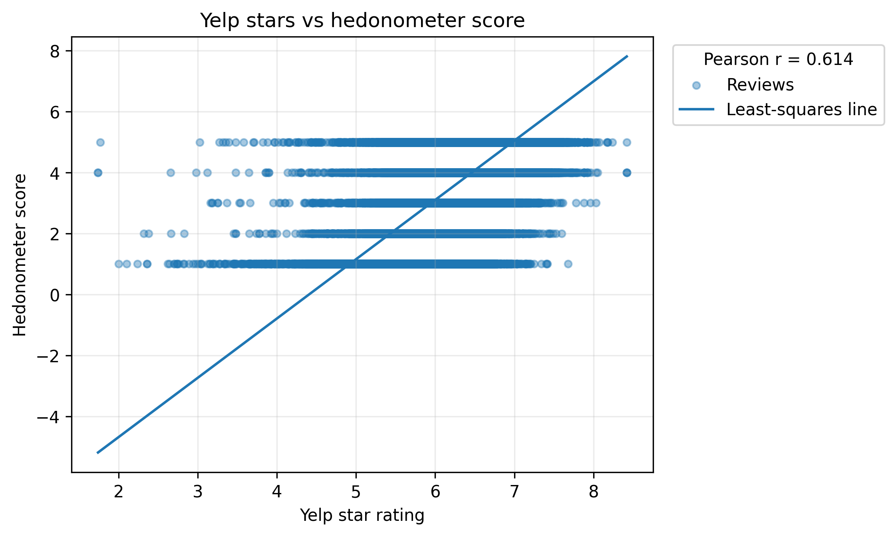
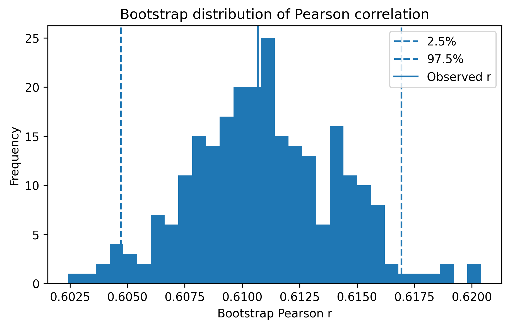
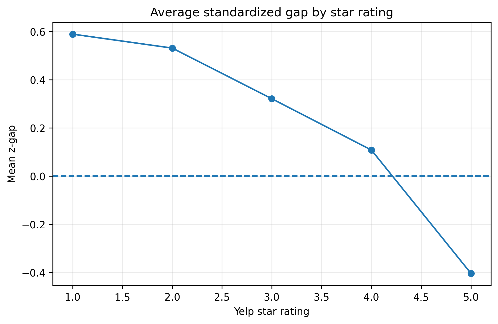

## Hedonometer Project Group 8: Investigating the Correlation between Happiness Scores and Star Ratings in the Yelp Open Dataset


# 1. Introduction
Sentiment detection has, in recent years, become an increasingly prominent and important field of research. The internet provides a massive corpus of texts, from which sentiments are extracted, and information thereby gained is used for a variety of purposes, such as predicting the stock market or evaluating the success of marketing campaigns in real time (Reagen et al. 2017). As sentiment detection plays an ever-larger role in decision-making, it is important to think critically about the data these instruments are based on, the data they are being applied to, and generally the complexity of sentiment expression through language. To evaluate how well the LabMT hedonometer is able to gauge sentiment, this project will apply it to customers' reviews of businesses on Yelp. The Yelp dataset includes full review texts, along with the star rating given by the user and exhaustive metadata. This dataset was chosen because the star ratings provide a second measure of sentiment against which the accuracy of the LabMT sentiment dictionary can be assessed. The research question this project seeks to answer is thus as follows: To what extent does the LabMT hedonometer happiness score of Yelp customer reviews correlate to the star ratings given by the reviewers? 

# 2. Background
Sentiment analysis is a process in which tools from natural language processing, machine learning and computational linguistics are used to identify and categorize opinions and emotions expressed in a piece of writing. There are different ways to approach this, one of which is a dictionary-based method. The LabMT hedonometer is of this type. It contains 10,222 words, for each of which a happiness score was determined. This was done through Amazon Mechanical Turks (Dodds et al., 2011). The accuracy of the resulting dataset has been tested before, notably by Reagen et al. (2015). This study found that the LabMT hedonometer is able to predict whether a single movie review is positive or negative with 65% accuracy. With a higher number of reviews, the accuracy increases. Going beyond simply predicting positivity or negativity, the situation becomes more complex. Pang and Lee (2005) tested humans and algorithms in their ability to predict exact star ratings, and found that humans are only able to do this accurately about 65% of the time. Sentiment analysis algorithms were 55-75% accurate. While there have been many advances in sentiment analysis since the study was published, and it does not test dictionary-based instruments, the key insight remains valid. Review texts only partially reflect star ratings, making it difficult for humans and automated systems to gauge precise ratings based on the texts. 

# 3. Yelp Open Dataset
The Yelp open dataset is an ideal resource for a critical analysis of the LabMT hedonometer. It includes nearly seven million reviews across eight metropolitan areas in North America, as well as metadata about the businesses and users (Kaggle). The large amount of metadata opens up many avenues for further research, which will be elaborated on later. However, as the scope of this project is limited, only the file containing reviews, along with star ratings, user ID, and business ID is utilized here. The review text serves as the input for sentiment analysis, while the associated star ratings provide a ground-truth measure of user sentiment against which the hedonometer scores can be compared. This strategy of using reviews to stress-test sentiment analysis tools is common and can yield valuable insights, as Reagen et al. (2015) and Pang and Lee (2005) demonstrate. The size of the Yelp dataset is another factor that makes it well-suited to this project. Individual reviews are relatively short and may yield inaccurate sentiment estimates, given that dictionary-based instruments such as LabMT produce less reliable results when applied to short texts rather than large corpora. The size of the dataset allows for the identification of aggregate patterns across many individual observations, making meaningful findings possible despite the brevity of the texts. Working with the entire seven million reviews, however, is not practicable within this project, a point that will be explained in the next section. 
 
# 4. Methodology


## 4.1 Data acquisition 
The Yelp Open Dataset was accessed through Kaggle. The dataset can also be obtained via the official website of Business Yelp. An obstacle we encountered when attempting to store the data in GitHub (data/raw/) was that the files exceeded GitHub’s file size limit. Therefore, we downloaded Git Large File Storage (LFS) to store references to the files in the repository. Our initial attempts to manage the files using Git LFS proved to be impractical due to issues with the installation and quota limitations. Consequently, we devised another approach: excluding raw data files via .gitignore and providing clear instructions for downloading and replicating the data. As the next step, each team member independently downloaded the dataset from Kaggle and stored it in the same folder. While this approach preserves the functionality of the repository and avoids technical complexity, it introduces dependency on external data access and assumes consistency between local environments. This may affect reproducibility because of the differences in, for example, dataset versions, the timing of downloads and local configurations, which can lead to variations in the data. 

## 4.2 Data sampling and cleaning
First, the review dataset was processed line by line to avoid memory limitations. Each JSON was evaluated individually and only the following columns were kept: review ID, user ID, business ID, stars, text, and date. Reviews with empty text and malformed lines were skipped over to prevent processing errors. 

To determine an appropriate sample size, subsamples ranging from 1,000 to 200,000 reviews were evaluated. For each size, the mean and standard deviation of Yelp star ratings were computed. Stability in these summary statistics was observed at approximately 50,000 observations. Therefore, a randomized sample of 50,000 reviews was selected, balancing computational efficiency with statistical reliability.

### Sample Size Stability Check
| Sample Size | Mean Stars | SD Stars | Number of Reviews |
|-------------|------------|----------|-------------------|
| 1,000   | 3.728 | 1.479 | 1,000 |
| 3,000   | 3.763 | 1.462 | 3,000 |
| 10,000  | 3.737 | 1.482 | 10,000 |
| 25,000  | 3.742 | 1.476 | 25,000 |
| 30,000  | 3.752 | 1.474 | 30,000 |
| 50,000  | 3.752 | 1.476 | 50,000 |
| 100,000 | 3.752 | 1.477 | 100,000 |
| 200,000 | 3.754 | 1.477 | 200,000 |
 
Lastly, a final random sample of 50,000 was produced in a compressed CSV gzip for further analysis.  

## 4.3 Data matching
The LabMT dataset was loaded as a dataframe, and irrelevant columns were disregarded. Two columns remained, “word” and “happiness_score”. Words with happiness scores between four and six were removed from the LabMT lexicon. This range is considered emotionally neutral in the LabMT framework. Because neutral words are very common, including them would push average review scores toward the midpoint of the scale and weaken the influence of clearly positive or negative words. Afterwards, 3,731 words were left in the LabMT dictionary. 
The cleaned random sample of Yelp reviews was tokenized. A dataframe containing one token per row and the associated review ID was created. The two dataframes were then merged, matching “tokens” with the corresponding word in the LabMT dictionary and attaching the associated happiness score. However, not all tokens could be matched. Many reviews contain informal language, slang or abbreviations (for example, one review begins with “never ‘yelped’ b4” [review id: xlvN59kqb_89HViVW3tApg]). Rows that contained a token but had no happiness score were marked as OOV. Out of a total of 21,180,467 tokens, 15,643,779 tokens were not matched, for an overall OOV rate of ~0.7386.
In the next step, a review-level summary was created. All tokens with the same review ID were grouped and summaries for each group computed. The summaries include:
the average happiness score of all matched tokens in a review, ignoring NaN values
how many tokens each review contains
how many of the tokens were matched to a word in the LabMT dataset
how many tokens were OOV
the proportion of OOV tokens in each review 
The summary was then merged back onto the cleaned Yelp reviews sample. The final dataset was saved as a CSV gzip file. Below is a table showing each column included in the final dataset, along with its Dtype and the number of NaN values in it.

### Dataset Description
| Column Name         | NaN | Dtype    |
|---------------------|-----|----------|
| review_id           | 0   | str      |
| user_id             | 0   | str      |
| business_id         | 0   | str      |
| stars               | 0   | float64  |
| text (review)       | 0   | str      |
| date                | 0   | str      |
| tokens              | 0   | object   |
| hedonometer_score   | 15  | float64  |
| total_tokens        | 13  | float64  |
| matched_tokens      | 13  | float64  |
| oov_tokens          | 13  | float64  |
| oov_rate            | 13  | float64  |

The 13 missing values in the columns "total_tokens", "matched_tokens", "oov_tokens", and "oov_rate" are presumably the result of 13 reviews having no text that was recognized as such. During the tokenization process, it was specified that each token must consist of alphabetical letters. Thus, a review that, for example, only consists of an emoji would produce no tokens and contribute to the NaN values. Two reviews additionally contained tokens, but were entirely made up of either OOV words or words with a happiness score between four and six. This explains the 15 NaN values in the column “hedonometer_score”. 

## 4.4 Statistical analysis
To answer the research question, the following steps were taken:
```mermaid
flowchart LR
A[Compute descriptive statistics for variables of interest<br/>(star rating, happiness score and review length)]
-->
B[Examine happiness by star rating by grouping data and computing mean, median, standard deviation, and happiness score]
-->
C[Assess association between star rating and hedonometer score using covariance and Pearson’s correlation coefficient]
-->
D[Quantify uncertainty in correlation estimates using bootstrapping]
-->
E[Interpret relationship by transforming star ratings and hedonometer scores into comparable units using standardized regression]
```

### Descriptive statistics
Descriptive statistics (mean, median, variance, skewness, etc.) were computed for star rating and hedonometer score. As text length has been shown to influence hedonometer accuracy (Reagan et al., 2015), the same was done for text length. 

### Grouped analysis
To explore the relationship between variables, observations were grouped by star rating. For each group, the mean, median and standard deviation were computed.

### Correlation analysis
The linear association between star ratings and happiness scores was assessed using covariance and Pearson’s correlation coefficient, defined as:
r = cov(x, y) / (sₓ sᵧ)
This approach assumes an approximately linear relationship, which was visually assessed using a scatter plot with a fitted regression line.

### Bootstrap procedure
To quantify uncertainty in the correlation estimate, bootstrap resampling was performed on the 50,000-observation sample. The bootstrap distribution was used to estimate the standard error and 95% confidence interval.

### Standardized regression
To make the relationship between the variables more interpretable, both variables were standardized (z-scores), and a linear regression model was fitted:
zₛₜₐᵣₛ = a_z + b_z zₕₑdₒₙₒₘₑₜₑᵣ

### Z-score gap analysis
To further compare the variables, a z-gap was defined:
z-gap = z(stars) - z(hedonometer)
This metric captures the discrepancy between star rating and hedonometer score. A positive z-gap indicates that star rating is more positive than the language as measured by the hedonometer. A negative z-gap indicates that the language is more positive than the star rating. The z-gap was analyzed overall and grouped by star rating.


# 5. Results
## 5.1 Descriptive statistics
Review length 
Reviews contain on average 105 tokens (median = 75), with a high standard deviation (~98), indicating substantial variability and a right-skewed distribution with some very long reviews. When examined by star rating, a pattern can be observed. 
fig.1 

### Average Tokens per Review by Star Rating
| Stars | Avg Tokens per Review |
|-------|----------------------|
| 1.0 | 132.3730 |
| 2.0 | 133.4634 |
| 3.0 | 124.0870 |
| 4.0 | 108.2454 |
| 5.0 | 84.7601 |

Lower-rated reviews are substantially longer than higher-rated ones. One- and two-star reviews contain on average over 130 tokens, while five-star reviews average
fewer than 85 tokens. This has implications for the statistical analysis that
will be explored in discussion.

fig.2 

### Star ratings
| Statistic | Value |
|------------------|--------|
| n | 50,000 |
| min | 1.000 |
| max | 5.000 |
| range | 4.000 |
| mean | 3.745 |
| median | 4.000 |
| q10 | 1.000 |
| q25 | 3.000 |
| q50 | 4.000 |
| q75 | 5.000 |
| q90 | 5.000 |
| IQR | 2.000 |
| sample variance | 2.185 |
| sample SD | 1.478 |
| MAD | 1.000 |
| skewness | -0.844 |
| excess kurtosis | -0.773 |

Star ratings have a mean of 3.745 and a median of 4.000. The distribution is negatively skewed (skewness coefficient = -0.844), with a longer tail on the left. Most values are then on the right, indicating that star ratings are concentrated around higher values. Excess kurtosis is negative (-0.773), which means that the data is spread across the scale, rather concentrated in the tales, so not so many extremes are present. The interquartile range is 2.000, with 50% of the ratings falling in between three and five. The standard deviation is 1.478, suggesting a high variability in review rating.

fig.3 

### Hedonometer score
| Statistic        | Value |
|------------------|-------|
| n                | 49,990 |
| min              | 1.960 |
| max              | 8.180 |
| range            | 6.220 |
| mean             | 6.329 |
| median           | 6.383 |
| q10              | 5.731 |
| q25              | 6.072 |
| q50              | 6.383 |
| q75              | 6.638 |
| q90              | 6.862 |
| IQR              | 0.566 |
| sample variance  | 0.217 |
| sample SD        | 0.466 |
| MAD              | 0.278 |
| skewness         | -0.826 |
| excess kurtosis  | 2.275 |

The happiness scores range from 1.960 to 8.180, with a mean of 6.329 and median of 6.383. The distribution is also slightly negatively skewed (skewness coefficient = -0.826) with a positive excess kurtosis of 2.275, indicating a heavier tail than for a normal distribution. The interquartile range is 0.566, meaning that most values are clustered within a relatively small range. This is also evident from the standard deviation (0.466), which suggests a relatively low variability in happiness scores among the reviews.

fig.4 

| Measure           | Star ratings | Hedonometer score | Interpretation                                      |
|------------------|-------------|------------------|-----------------------------------------------------|
| Mean             | 3.745       | 6.329            | Both lean positive                                  |
| Median           | 4.000       | 6.383            | More concentrated on the right  (positive bias)        |
| SD               | 1.478       | 0.466            | Stars vary much more                              |
| IQR              | 2.000       | 0.566            | Stars spread wider; sentiment tightly clustered    |
| Skewness         | -0.844      | -0.826           | Both left-skewed (mostly positive)                  |
| Excess kurtosis  | -0.773      | 2.275            | Ratings flatter; sentiment has heavier tails       |

Overall, both variables are skewed toward positive values, but happiness scores vary less than star ratings. However, star ratings show much more variability, indicating that reviewers express stronger differentiation through stars than they do through language in the reviews. At the same time, it is important to outline that this can be influenced by that fact that hedonometer scores are concentrated in the positive range, which limits how strongly the language reflects differences in stars.

## 5.2 Happiness by star rating
### Summary Statistics by Star Rating
| Stars | Mean | Median | Count | Std |
|-------|--------|--------|-------|-------|
| 1.0 | 5.7407 | 5.7889 | 7708 | 0.4320 |
| 2.0 | 6.0296 | 6.0613 | 3828 | 0.3837 |
| 3.0 | 6.2461 | 6.2618 | 4880 | 0.3492 |
| 4.0 | 6.4593 | 6.4651 | 10663 | 0.3321 |
| 5.0 | 6.5344 | 6.5443 | 22911 | 0.3540 |

fig.5 

Hedonometer scores increase monotonically with star rating. One-star reviews have a mean happiness score of 5.741, while five stars have a mean of 6.534. The intermediate values follow the same trend, indicating a positive relationship between textual sentiment and ratings. 

The standard deviation is highest amongst low ratings (one-star ratings, two-star ratings) suggesting more emotionally varied language in lower ratings.

## 5.3 Association Between Star Rating and Happiness
### Association Between Star Rating and Happiness

| Measure | Value |
|--------|------|
| Sample covariance (stars, happiness) | 0.4203 |
| SD (stars) | 1.478 |
| SD (happiness) | 0.466 |

The sample covariance is 0.4203, suggesting that variables move together in the same direction. 

fig.6 

The coefficient 0.6107 further indicates a moderately strong positive relationship between star rating and happiness score. The scatter plot reveals considerable overlap in hedonometer scores across different star ratings, indicating that reviews with the same rating can vary substantially in language sentiment. Worth noting is that five-star ratings still include moderately negative language, while one-star ratings include moderately positive language. This suggests that, while higher ratings are associated with higher hedonometer score, hedonometer score does not perfectly predict star rating. 

## 5.4 Bootstrap results
### Association Between Star Rating and Happiness
| Measure | Value |
|--------|------|
| Sample covariance (stars, happiness) | 0.4203 |
| SD (stars) | 1.478 |
| SD (happiness) | 0.466 |

The histogram below illustrates the bootstrap distribution of Pearson’s correlation. It is approximately symmetrical, centered around 0.6110 with a standard error of 0.0032. This value is very close to the observed estimate of 0.6107. The 95% bootstrap confidence interval ranges from 0.6047 to 0.6169. This suggests that the positive relationship between star ratings and hedonometer scores is not due to random sampling variation, but reflects a stable association in the data. At the same time, the narrow confidence interval reinforces that the strength of the relationship is consistently moderate rather than strong, supporting the interpretation that sentiment scores capture general trends but do not fully explain variation in ratings.

fig.7 

## 5.5 Standardized regression
 ### Standardized Regression Results

| Intercept (a_z) | Slope (b_z) | R² |
|-----------------|-------------|----|
| -0.0000 | 0.6107 | 0.3729 |

A one standard deviation increase in hedonometer score corresponds to a 0.6107 standard deviation increase in star rating. This represents a moderate effect size, and the effect is statistically significant. R² indicates that 37.29% of the variance in star ratings is explained by happiness scores. Because both variables are standardized, the intercept is approximately zero, which reflects that both variables are centered at their means. In this specification, the intercept does not carry substantive meaning beyond confirming correct standardization.


## 5.6 Z-score gap analysis
The mean is 0.0000 and the median is 0.0076, with a standard deviation of 0.8784. The standard deviation reflects the substantial variability in the difference between ratings and sentiment, consistent with the moderate rather than perfect correlation between the variables. The mean and median z-gaps show that hedonometer score and star rating are overall aligned.

### Z-Score Gap by Star Rating
| Stars | Mean X Z | Mean Y Z | Mean Z Gap | Median Z Gap | Count |
|-------|----------|----------|------------|--------------|-------|
| 1.0 | -1.2741 | -1.8631 | 0.5890 | 0.7008 | 30425 |
| 2.0 | -0.6539 | -1.1850 | 0.5311 | 0.5849 | 15504 |
| 3.0 | -0.1860 | -0.5069 | 0.3209 | 0.3575 | 19988 |
| 4.0 | 0.2791 | 0.1712 | 0.1078 | 0.1195 | 42266 |
| 5.0 | 0.4448 | 0.8494 | -0.4045 | -0.3839 | 91775 |

A clear pattern emerges:
Lower ratings (one to three): ratings are more positive than the language suggests
Mid ratings (four): strong alignment
Highest rating (five): language is more positive than the ratings suggest
This indicates a systematic mismatch between ratings and textual sentiment that varies by rating level.
fig.8 

# 6. Discussion
This project set out to evaluate the extent to which LabMT hedonometer scores correlate with Yelp star ratings. The results show a moderately strong positive relationship (r ≈ 0.61), indicating that textual sentiment and user ratings are aligned to a meaningful degree. However, with an R² of approximately 0.37, indicates that the majority of variation in star ratings remains unexplained by hedonometer scores. This suggests that while dictionary-based sentiment analysis captures general emotional polarity, it is insufficient for predicting precise user evaluations.
This could be explained in multiple ways. A possible explanation emerging from the analysis is that ratings and review text appear to serve different communicative functions. Star ratings represent an evaluative decision, whereas review texts can be interpreted as justifications of that decision. This distinction may help explain why reviews with similar ratings can vary substantially in sentiment, an interpretation that is consistent with the variation in review length. Lower-rated reviews are substantially longer and therefore contain more sentiment-bearing tokens overall. With more tokens contributing to the average, strongly negative expressions can accumulate and pull the hedonometer score further downward, resulting in more negative sentiment relative to the rating. In contrast, higher-rated reviews are shorter on average and thus contain fewer sentiment-bearing tokens, meaning that individual positive words may have a stronger influence on the overall score. This asymmetry aligns with the observed z-score gap: lower-rated reviews exhibit sentiment that is more negative than their ratings would suggest, while higher-rated reviews show more positive sentiment relative to their ratings. Taken together, these patterns suggest that the mismatch between ratings and hedonometer score arises from both differences in how evaluations are expressed in text and from the aggregation properties of the hedonometer itself.
The results also highlight a scale mismatch between the two variables. Star ratings are discrete and bounded between one and five, while hedonometer scores are continuous and span from one to ten. This structural difference limits the extent to which the two measures can align, even under ideal conditions. Additionally, the analysis assumes a linear relationship between ratings and sentiment, yet user perception of rating differences may not be linear. For instance, the distinction between four and five stars may carry more weight than that between one and two stars. The z-score gap analysis provides some indication of this. The difference between the mean z-gap for one- compared to two-star ratings is minor (difference of ~0.06). For four- and five-star ratings, the mean z-gap is substantially larger (difference of ~0.51). Differences between intermediate categories are more moderate at approximately 0.21. This could be interpreted as the perceived distance between one and two stars being very low, while five stars are felt to be far more positive than four. For ratings between two and four, perception of rating differences appears to be more linear. However, this interpretation should be treated with caution, as the z-gap reflects differences between standardized measures rather than direct evidence of user perception. 
Taken together, these findings suggest that dictionary-based sentiment analysis tools like the LabMT hedonometer are useful for capturing aggregate emotional trends, but have clear limitations when applied to individual-level prediction or precise evaluation tasks.

# 7. Limitations
This study is subject to several limitations, which stem from the hedonometer itself, the Yelp dataset and the adopted methodology.
There are limitations inherent to the hedonometer. Since this project aims to evaluate the applicability of the hedonometer to review data, these constraints form part of the object of analysis and help explain the observed discrepancies between star ratings and sentiment scores rather than being true limitations. Regardless, they are important to mention as they directly contribute to the imperfect alignment observed between star ratings and happiness scores. One such limitation is the high OOV rate (73.85%), meaning that a large proportion of words in the reviews are not included in the hedonometer scoring. While some of this is due to standard preprocessing steps such as the exclusion of neutral words from the LabMT lexicon, the hedonometer also does not account for slang, emojis, or domain-specific language commonly used in online reviews. Since such expressions can carry strong sentiment, their exclusion likely weakens the observed relationship between textual sentiment and star ratings. In addition, the hedonometer is a lexicon-based method that assigns fixed sentiment scores to individual words and does not consider context (Dodds et al., 2011). As a result, it cannot account for negation, sarcasm, or sentence-level meaning, which may lead to misclassification of sentiment. 
There are also limitations to the project itself. Starting with the Yelp dataset, the analysis is restricted to a sample of 50,000 reviews. While the sample size was chosen based on the observed stability of key summary statistics, it is possible that not all patterns present in the full dataset are captured. In particular, rare linguistic expressions, subgroup differences across businesses or locations, and more complex relationships between variables may be underrepresented. However, given the large sample size, these effects are likely limited, and the main results are expected to be robust. In regard to potential differences between subgroups, it was outside of the scope of this project to analyze how the relationship between stars and scores may vary across different categories or locations, two variables that offer many directions for further research. The Yelp dataset is also limited to reviews from North America. Since Amazon MTs are primarily based in the US as well, utilizing a dataset that includes reviews globally could yield especially interesting insights. For example, testing if the correlation between stars and happiness scores changes when the reviews are sourced from a location that has cultural norms around sentiment expression distinct from those found in the US could produce findings valuable to sentiment analysis generally.
Our project is further limited in its methodology. The analysis assumes a linear relationship between star rating and hedonometer score. However, our findings indicate that the relationship may not be fully linear. As Pearson’s correlation coefficient works best for linear relationships and has a tendency to underestimate or misrepresent non-linear ones, the true correlation between ratings and scores may be stronger than we have been able to capture. Exploring nonlinear or ordinal models could provide a more accurate representation of this relationship. Finally, there is a limitation in using a single sentiment method. As we only utilize the LabMT hedonometer, it is impossible to say whether our findings reflect a problem with the hedonometer specifically or a broader difficulty of extracting review sentiment from text. Comparing the performance of the LabMT hedonometer to that of other sentiment analysis tools is thus another direction for further research.

# 8. Corpus and provenance 
The Yelp Open Dataset consists of user-generated reviews produced within a specific platform environment, and its structure reflects both technological and social constraints. Reviews are written voluntarily, meaning that the dataset is not a random sample of customer experiences. Users who choose to leave reviews are more likely to have had particularly positive or negative experiences, which may systematically bias both the distribution of ratings and the language used.
Review texts are also produced with different possible audiences and purposes in mind. Some users may aim to provide clear and informative evaluations, while others may write more informally and include references, comparisons, or context that are meaningful primarily to themselves and those they know. For example, a reviewer might describe a restaurant experience relative to the cooking skills of a person in their life (e.g. “the food was almost as bad as Aunt Kathy’s potato salad”). While such expressions can convey clear sentiment to human readers, they may not be captured by a dictionary-based method such as the LabMT hedonometer.
Additionally, the platform combines two structurally different forms of evaluation, a discrete star rating and a free-form textual review. These components are produced under different constraints and may encode sentiment in different ways. Finally, the dataset is exclusively composed of reviews from North America, meaning that linguistic conventions and norms of expression are culturally specific.
The dataset is thus shaped by user intent, context, and platform design. As a result, the relationship between textual sentiment and numerical ratings should be interpreted with these factors in mind.

# 9. Conclusion
This study examined the extent to which LabMT hedonometer happiness scores align with Yelp star ratings. The results indicate a moderately strong positive correlation (r ≈ 0.61), suggesting that textual sentiment and user ratings are meaningfully related. However, the relatively low explanatory power (R² ≈ 0.37) shows that a substantial portion of variation in star ratings is not captured by hedonometer scores.
Further analysis revealed systematic differences between textual sentiment and ratings across rating levels. Lower-rated reviews tend to contain more negative language than their ratings would suggest, while higher-rated reviews often exhibit more positive sentiment than expected. This pattern highlights a consistent mismatch between how users express sentiment in text and how they assign numerical evaluations.
These findings are relevant beyond the specific case of Yelp reviews. They illustrate a broader limitation of dictionary-based sentiment analysis. Such tools can capture general emotional trends in large-scale text data, but they struggle to reflect the full complexity of human evaluation. Ratings and written language do not serve identical functions, and reducing sentiment to word-level scores inevitably overlooks context, nuance, and communicative intent.
Overall, this project underscores the importance of critically assessing how sentiment analysis tools are applied and interpreted. While the LabMT hedonometer is useful for identifying aggregate patterns, it should not be treated as a precise proxy for user satisfaction. More broadly, the results highlight the challenge of quantifying subjective human experiences through simplified computational measures, suggesting that future research should incorporate more context-sensitive approaches to better capture how people express and evaluate their experiences.

# 10. How to Run the Project
Clone the repository into one’s VS Code. 
Set up the virtual Python environment
python3 -m venv venv
source venv/bin/activate
Install the dependencies
pip install -r requirements.txt
Ensure that Git LFS has been installed
Download the Yelp dataset from https://www.kaggle.com/datasets/yelp-dataset/yelp-dataset 
This is not in the raw data folder, as the Yelp dataset is over 4GB.
Run the datacleaning.py script in the src/assignment-2. This produces the clean dataset sample called yelp_sample.csv.gz
Running this code may take a few minutes, as the Yelp dataset is being reviewed by each line to prevent the system from crashing. 
It will be stored in the data/processed/ folder.
Run the measurement.py and the analysis.py
measurement.py produces yelp_hedonometer_scores.csv.gz in the data/processed/ folder
analysis.py produces summary statistics: stars, summary statistics: hedonometer score,  covariance, pearson correlation, z-score comparison, bootstraps correlation, scatter plot with fitted line, and standardized regression plot

# 11. Sources
Dodds, P. S., Harris, K. D., Kloumann, I. M., Bliss, C. A., & Danforth, C. M. (2011). Temporal Patterns of Happiness and Information in a Global Social Network: Hedonometrics and Twitter. PloS One, 6(12), e26752. https://doi.org/10.1371/journal.pone.0026752
Hartmann, J., Heitmann, M., Siebert, C., & Schamp, C. (2023). More than a Feeling: Accuracy and Application of Sentiment Analysis. International Journal of Research in Marketing, 40(1), 75–87. https://doi.org/10.1016/j.ijresmar.2022.05.005
Pang, B., & Lee, L. (2005). Seeing stars: Exploiting class relationships for sentiment categorization with respect to rating scales. In K. Knight, H. T. Ng, & K. Oflazer (Eds.), Proceedings of the 43rd Annual Meeting of the Association for Computational Linguistics(pp. 115–124). Association for Computational Linguistics. https://doi.org/10.3115/1219840.1219855
Reagan, A. J., Tivnan, B., Williams, J. R., Danforth, C. M., & Dodds, P. S. (2015). Benchmarking sentiment analysis methods for large-scale texts: A case for using continuum-scored words and word shift graphs. https://doi.org/10.48550/arxiv.1512.00531
Reagan, A. J., Danforth, C. M., Tivnan, B., Williams, J. R., & Dodds, P. S. (2017). Sentiment analysis methods for understanding large-scale texts: a case for using continuum-scored words and word shift graphs. EPJ Data Science, 6(1), Article 28. https://doi.org/10.1140/epjds/s13688-017-0121-9
Yelp Open Dataset. Kaggle 2026. 

# 12. AI Disclosure Use
This study ensures full responsibility and transparency of the use of AI (ChatGPT and AI Chat in VS Code). The AI was used to generate, explain and break down complex code, assist in methodological structuring, and provide clarification within the study. The AI-generated code was supervised, evaluated and edited by all authors. All results, conclusions, and interpretations are the responsibility of the authors. 
