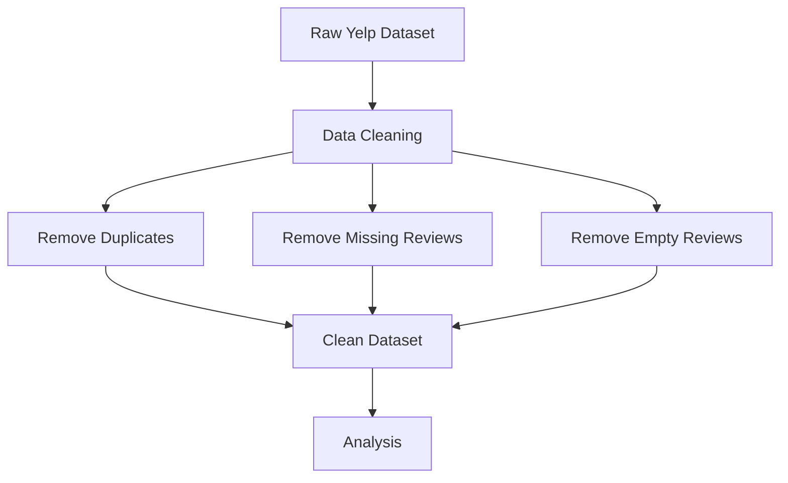
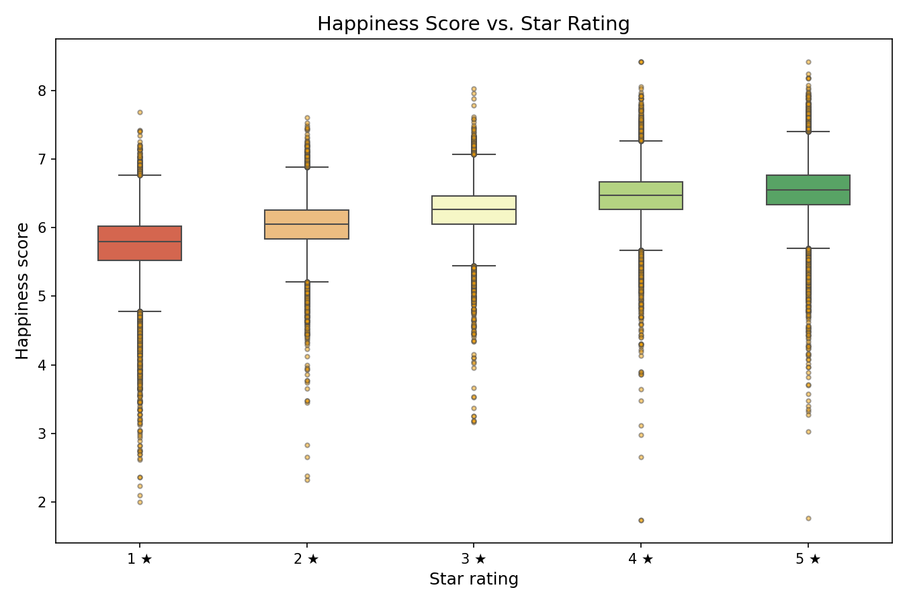
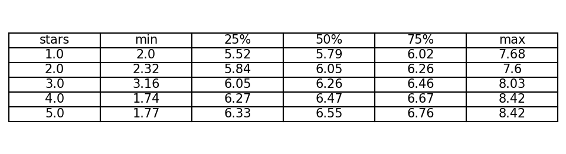

# Hedonometer Group 8 

---
# 1 The dataset

## 1.1 Loading the dataset

The dataset was loaded as a dataframe using the "pandas" library. The first three lines were skipped, as they contained comments rather than data. What remains are 10222 rows and eight columns. In four of these columns (twitter_rank, google_rank, nyt_rank and lyrics_rank) there are missing values (--). Missing values here mean that a word did not appear in a corpus, either at all or not at a frequency high enough to be given a rank.

## 1.2 Creating the data dictionary 

The first column, "word", contains 10222 words in the form of strings. In the column "happiness_rank", each word is ranked in terms of its percieved positivity or negativity (for example, a "2" in this column denotes the second most positive word overall), here in the form of an integer. The remaining columns contain float values. "Happiness_average" provides the mean score of every word's negativity or positivity across raters. The standard deviation, so to what extent there was disagreement between raters about a word's positivity or negativity, is given in the column "happiness_standard_deviation". There are no missing values in any of the columns listed so far. In the columns "twitter_rank", "google_rank", "nyt_rank" and "lyrics_rank", there are 5222 missing values per column. The columns show the frequency rank of each remaining word in the respective corpus. "Twitter_rank" thus ranks each word that appeared in the Twitter corpus based on how frequently it appeared, with lower values again indicating higher frequency. "Google_rank" does the same for words in the Google corpus, "nyt_rank" for the New York Times corpus, and "lyrics_rank" for a corpus of lyrics.

## 1.3. Sanity checks

The first sanity check implemented is a schema check. All eight columns are defined as expected columns, and the check returns "True" if the dataframe contains all expected columns. This ensures that the right file was loaded, the right delimiter used and that no accidental changes were made to the dataset. Second, there is a value-range check. This returns the lowest and highest values in "happiness_average", and the lowest value in "happiness_standard_deviation". The values for "happiness_average" should be between one and nine, and the standard deviation should not be negative. If the check returns a value outside of what is expected, the column may not have the right dtype, the data may be corrupted or there may be parsing errors.

The ten most positive and negative words by average happiness intuitively make sense. Five out of the ten most positive words are different forms of the root word "laugh", there are two forms of the root word "happy", as well as "joy", "excellent" and "love". Laughter is a natural indicator of happiness, for which joy is practically synonymous, and, together with love, happiness is one of the most positive emotions. "Excellent" is a bit more surprising, as it does not feel like a significantly more positive way of describing something than "marvelous", "perfect", "outstanding", and so on. The ten most negative words pattern around the domains death and violence. Seven of them directly or indirectly relate to death. Six of the words are connected to violence. What stands out is that the root word "terror" appears twice, once as "terrorist" and once as "terrorism". That "terrorist" is considered a more negative word than "rape", and "terrorism" is percieved more negatively than "death" is somewhat surprising. However, in the context of a post-9/11 world that fought a war on terror for 20 years, the strong negative connotations of "terror" again make sense.

# 2. Quantitative exploration: distributions and relationships

## 2.1 Distribution of happiness scores 
Firstly, the distribution is centered around 5 to 6 on average happiness score. The highest concentration of words are clustered approximately around 5.5 to 6. 
We can interpret this according to Dodds et al. (2011) who discuss that the ratings of the word "happiness" are not entirely neutral at 5. Overall, the ratings are slightly more positive.  
The distribution of happiness scores is slightly skewed to the right, which indicates that it is skewed towards happiness. 
In conclusion, most of the scores fall between 5 and 6, with a peak around 5.5. This indicates that many words have happiness scores between 5 and 7. 

## Unexpected Pattern 
One pattern we did not expect was the happiness score above 7 would be less frequent than under 5. 
Additionally, there are more words rated slightly positive than slightly negative. 
We might expect symmetry around 5 because 5 is defined as neutral in the labMT scale (Dodds et al., 2011). However, the histogram shows a structural shift upward. 
This is unexpected because the distribution is uneven as more words are rated positively. 
This further supports the idea that common English words present a tendency towards higher happiness scores instead of true emotional neutrality. 

## 2.2 Disagreement: which words are "contested"? 
To identify contested words, we slected the 15 entries with the highest values in the happiness_standard_deviation column (y-axis). 
These words appear at the top of the scatterplot (highest values on the y-axis), which indicates strong disagreement among respondents about their emotional meaing. 
We have selected 5 of the "most disagreed-about" words to explore the reasons why they are contested: "fucking", "fuckin", "fucked", "pussy", and "whiskey". 
These words have the highest standard deviation values which signifies that they generate the most disagreement about how positive or negative the words are. 

## Analysis
The main characterstic of these words is that they have negative connotations associated with them. For example, the words "fucking", "fuckin", "fucked", and "pussy"  are vulgar and considered highly inappropriate and offensive. Even though such words can be used in daily casual conversations as slang, they still hold very negative meanings. 
Meanwhile, "whiskey" has a neutral meaning and refers to the alcoholic beverage. We can consider how some may associate it with leisure, celebration, or socializing. Therefore, individuals may rate it positively. 
On the other hand, others can associate "whiskey" with negative experiences, alcohol abuse, or simply because they do not like it. Consequently, the word will have a lower happiness score. 
In general, the 5 words are contested because they are problematic, in the way that they can cause issues if they are used to verbally insult or harm someone (except for "whiskey"). The high standard deviation reflects the degree of disagreement of the emotional tone of the words. 
Some respondents perceive these words as strongly negative, while others interpret them as neutral or even positive. This depends on the context and personal experiences. 

## 2.3 Corpus comparison: what counts as "common language" depends on where you look
The four different corpora all represent various contexts and styles of language usage. 
Firstly, Twitter represents informal and real-time communication between users in daily situations. Tweets often contain casual diction such as slang and abbreviations. 
Furthermore, Google Books represents a broad and historical range of language from  books, with more formal and edited words across genres and time periods. 
The New York Times corpus provides formal vocabulary that is based on specific topics and shaped by reporting conventions. 
Lastly, song lyrics form the most creative corpus among the others, in which language is highly expressive. 
We can suggest that these differences emphasize how "common language" varies across corpora and depends on what kind of individuals are represented. 
Language styles, choice of vocabulary, and many other factors influence what is perceived as "common language".

## 3.1 Word Exhibit

Within both the “Very Positive” and “Very Negative” categories, the words that are presented have a universal connotation. The words in “Very Positive” are all synonyms of each other and are typically used in a positive manner. The meanings within the “Very Negative” category have very obvious negative connotations and societal implications, as some of the words engage in human rights abuse. Both categories' words spark an emotional reaction that warrants their respective scores. However, some words found in the “Highly Contested” and “Surprising” categories have iterations of each other or found in both lists; for example, the words “fucking,” “pussy,” and “capitalism.” Unlike the other two categories, the meanings and contexts of these words depend on where they are found and how they are used. Hence, they are found in their respective categories, as different communities may see these words as vulgar or a way to express oneself. 

A happiness score depended on how it was interpreted and evaluated by the Amazon Mechanical Turk. Unfortunately, this would not account for the varied perspectives in the English community and how different speakers might construe the given words. The words captured in the word_exhibit.md encompass both universal meanings and a range of meanings. The Muslim community may approach the word “Islam”  with a sense of reverence, as it is a major world religion. Meanwhile, the far-right Republican Party in the United States may use this word to fearmonger or spread misinformation to the general public. Another instance would befall the word “whiskey,” as the alcoholic community would see the beverage in a negative manner, while others may see it as a way to pass the time. From person to person and community to community, the use of words found in the table triggers a different emotional reaction depending on people’s life experiences and societal connotations. 

## 4.1 Reconstruct the pipeline (data provenance)
> *Hedonometer is a methodological tool proposed by Dodds et al. (2011) for large-scale, text-based measuring of happiness. In a nutshell, this method allows to assess the average happiness expressed in large texts by using happiness score applied to frequently used words.*

The data set already includes the information from labMT lexicon - a word-happiness dictionary used to measure emotional valence. The columns include following variables: words, happiness_rank, happiness_average, happiness_standard_deviation, twitter_rank, google_rank, nyt_rank, lyrics_rank. Based on this information we can reconstruct the pipeline:

---

### 1. Words selection

10,222 words were chosen, as the ones relevant for further evaluation. The selection usually happens based on the frequency of the words used in large corpora. These are a single word tokens, so the list does not include phrases or multiword expressions.

---

### 2. Happiness score assessment

During this step, the chosen words are being assessed by Mechanical Turks, who rate the words on the scale from 1 to 9. This score was used to compute happiness_rank, happiness_average, happiness_standard_deviation.

---

### 3. Corpus frequency analysis

Four corpora were chosen: Twitter, Google Books, New York Times and Song lyrics. After. Then the frequency was checked, how often does each word appear in each media. Based on this, ranks were assigned. So lower is the number, higher is the frequency.

---

### 4. Data merging

The data was merged into one table and missing values were encoded.

---

## 4.2 Consequences and limitations

### 1. Idiomatic expressions

The word selection includes exclusively single word tokens, thus, providing the word, which can appear as a part of idiomatic expression, completely shift the meaning when evaluated alone. For instance, word "kill", sitated on the lowest margine of happiness ranking with a very low score (1.70) is often used in positive slang like "he is killing it" or the word dead with the score 2.34 can be used in a phrase "drop dead", another example would be "break a leg". Single token words selection limits the ability of lexicon to capture idiomatic meaning that is an unseparable part of the language.

---

### 2. Textual positioning

Words are also evaluated outside of the context where they are situated. Through standard deviation we can see the words with highest disagreements amount annoators. For instance the word "pussy" can signify a different meaning depending on the context. This is also the word with the higher standard deviation (i.e. 2.67). The context can significantly shift in the meaning and emotional connotation and it's contextual position would impact the score given by Mechanical Turks.

---

### 3. Corpus heterogeneity

Rhetorics across 4 corpora significantly diverge: twitter - informal, New York Times - institutional, Google Books - broad, Song lyrics - poetic. These are very diverse and non neutral samples. Looking at the numerical indicators that are the same across 4 corpora, assumes that they measure the same thing, while in fact context, emotions, meanings of the words can significantly vary. As a result frequency patterns observed in the data set can indicate differences in rhetorics, rather that emotional language.

---

### 4. Annotator bias

Annotators are also not neutral machines, without culture and personal history. Personal emotional perception can significantly influence the score one assigns to the word. For instance, the words like love, joy appear on the higher end of the scale, with happiness score above 8 and standard devation around 0.9-1.1, which signifies a strong agreement amoung annotators. This can also indicate a shared cultural assumptiom and as a result emotional meanings become generalized. In my opinion, it is essential to provide background information on the people who rate the words, to address the diversity of cultural backgrounds and the possibility to speculate on generasability of the findings.

---

### 5. One-dimensional Likert scale

Likert scale is used to evaluate happiness level. This one-dimensional approach reduces multidimensional nature of qualitatively different emotions into one number, indicating "low happiness". The words from the sample: grief, suicide, anger can evoke very different emotions but still be put in the same category box.

---

## 4.3 Instrumental note

This data set can be well used for control variables for unsupervised semantic labeling. For large-scale quantitative analysis, comparison of relative values and identifying words that generate disagreement (happiness_standard_deviation) this dataset is extremely useful and methodologically transparent.

---

However, I would not use this dataset for generating claims on emotional meaning and discourse. A context deprived word list, does not reflect sarcastic, idiomatic and slang connotations that influence the meaning construction. Words that receive strongly negative (e.g. kill, dead) ratings, can significantly shift emotional function depending on the contextual positioning, idiomatic use and annotators positionality. This instrument reduce complexity to a simplified numerical score. Additionally, the assumption of comparable values derived from heterogeneous corpora risks masking how rhetorics shape emotional expression.

---

This data set is particularly generated for using the method proposed by Dodds et al. (2011). Thus, the limitations are inherent to it, only the change in the method can resolve outlined issues.

---

Although manual word labeling is the cornerstone of this work, it also presents many systematic technical limitations. First, although it is possible to normalize the bias of the average rating of multiple labelers by measuring the baseline value, artifacts remain in the data, which affects the quality of the data. Second, the small number of these labelers is problematic. Because of this, the marginal data of each labeler has too much influence on the final values. Statistical indicators (standard deviation, variance) suffer as a result. Third, this approach does not allow for large-scale research with a large corpus and, for example, cross-linguistic modality.

---
# Analyzing Happiness Scores in the Yelp Open Dataset 

## Introduction 
In this second mini-project, the labMT word list will be the instrument for measuring and analyzing the Yelp dataset. The Yelp corpus contains five files that include metadata about businesses (such as location data, attributes, and categories), users, reviews (which contain full review text, such as user_id and business_id), check-ins for a business, and users’ tips, which are shorter than reviews. For this project, we will use the two files containing business and review data. 
We will ask the following research question: **To what extent does the hedonometer happiness score of Yelp customer reviews correlate with the star ratings assigned to businesses, and do these emotional scores differ across metropolitan regions?** 
Using the hedonometer labMT word list as our framework, each Yelp review will be tokenized, matched, and the happiness scores of the matched words will be averaged to compute a review-level happiness score. The scores serve as both a quantitative measure and a visual representation of the emotional tone expressed by users in the reviews. 
The aim of this project is to compare whether the scores correlate with the star ratings that customers give to businesses. We will explore whether the happiness scores of the hedonometer can predict or provide a correlation with Yelp star ratings. This approach is relevant because it can provide meaningful insight into how customer sentiment, as measured by happiness scores, aligns with typical business reviews. We will have a broader understanding of how the words used in ratings reflect customer satisfaction. Consequently, businesses on Yelp might use such findings to better interpret feedback and improve their services. 
Additionally, this project analyzes the emotional tone in different regions. For example, whether reviews written by users in different urban areas, such as New York or Los Angeles in the U.S., tend to use more positive or negative words in reviews on average. 
---

## Data 

Data analyzed accounts for a random sample of 200.000 reviews. Each observation contains following fields: review metadata, star rating, business location, business category and review text. From the text of the review the hedonometer score was computed (see measurement.py). The goal was to estimate the emotional tone of the text using LabMT hapiness lexicon. 

Overview of the data:

| Variable | Description |
|--------|-------------|
| review_id | Unique identifier of a review |
| user_id | Identifier of the user who wrote the review |
| business_id | Identifier of the business being reviewed |
| stars | Yelp star rating (1–5) |
| text | Full review text |
| date | Date when the review was written |
| name | Business name |
| city | City where the business is located |
| state | State where the business is located |
| categories | Business category on Yelp |
| tokens | Tokenized words from the review |
| hedonometer_score | Average happiness score of matched LabMT words |
| total_tokens | Number of tokens in the review |
| matched_tokens | Tokens matched with the LabMT lexicon |
| oov_tokens | Tokens not found in the lexicon |
| oov_rate | Share of tokens outside the lexicon |

---

### Sampling strategy

The original Yelp dataset was extremely large, we analyzed a sample of 200.000. In order to create a managable data set, that would be possible to process, sampling was done on the cleaning stage (see datacleaning.py). The goal was to maintain statistical reliability while enabling computational efficiency. Nevertheless, no sampling is ever perfect and limitations have to be adressed. One of which is sampling variability, as it is only a part of large population, every sample takem from it can differ from each other. For transparency the bootstrap resampling was performed (see analysis.py), the estimates allow to see how results vary across different samples. Another limitation is risk of underrepresentation of certain fields inside of a taken sample, to mitigate this we use categories and states that have a certain number of observation (for category, threshold - 2000, for state, threshold - 1000). This increases reliability of regression estimates and crease variance to make comparison more meaningfull. Nevertheless, large and diverse sampling does not completely represent all Yelp reviews.

Before conducting statistical analysis, we checked for the distribution of variables in the taken sample to check for diversity.

### Star rating distribution

| Stars | Proportion |
|------|-----------|
| 1 | 0.152 |
| 2 | 0.078 |
| 3 | 0.100 |
| 4 | 0.211 |
| 5 | 0.459 |

### Top states in the sample

| State | Number of Reviews |
|------|------------------|
| PA | 46,533 |
| FL | 32,219 |
| LA | 21,939 |
| TN | 17,059 |
| IN | 14,742 |

### Largest business categories in the sample

| Category | Number of Reviews |
|---------|------------------|
| Restaurants | 33,829 |
| Food | 9,753 |
| Nightlife | 6,844 |
| Bars | 5,810 |
| American (New) | 4,954 |
| American (Traditional) | 4,931 |
| Breakfast & Brunch | 4,622 |
| Sandwiches | 3,606 |
| Seafood | 3,548 |
| Event Planning & Services | 3,402 |

---

## Statistics 

To answer the research question, we used the following regression model:

**hedonometer_score ~ stars + state_avg_stars**

Stars represent the rating of the review, and the state average stars account for the avaergae star rating in the same state. The second variable was introduced to controll for the fact that rating culture may be inherit to the state.

---

## Descriptives 

The average hapiness score increases with each star. Showing a positive relationship between the rating an emotional tone. Though, it is important to outline that 1 star from 5 stars is different in less than 1 point in the mean of hapiness score.

### Mean happiness score by star rating

| Stars | Mean Happiness | Count | Std |
|------|---------------|------|------|
| 1 | 5.739 | 30,425 | 0.437 |
| 2 | 6.028 | 15,504 | 0.370 |
| 3 | 6.245 | 19,987 | 0.353 |
| 4 | 6.462 | 42,266 | 0.338 |
| 5 | 6.539 | 91,773 | 0.348 |

---

## Findings 

An increase in one star in a Yelp rating is associated with 0.194 increase in hedonometer score, controlling for the average rating level in the state. The finding is statistically significant.

As mentioned above, the bootsrap was used for estimating uncertainty. We used it by business, as the same business may share the sentiment. Bootstrap confidence interval: **95% CI: [0.192, 0.195]**. This confirms stability of the positive relationship between hapiness score and star rating.

The boxplot above visualises the full distribution of hedonometer happiness scores across each star rating level (1–5). Each box represents the interquartile range (IQR) of happiness scores for that rating, with the horizontal line inside the box indicating the median. The whiskers extend to 1.5×IQR, and individual dots beyond the whiskers represent outliers.

The plot confirms the positive relationship reported in the descriptives: median happiness scores rise steadily from 1★ (median ≈ 5.79) to 5★ (median ≈ 6.55), consistent with the regression finding of a +0.194 increase per star.

In additional to the main research question, we decided to review if this relationship varies across states and categories. The result of state-level comparison suggests that the relationship between happiness and rating is consistent across states with a small variety in magnitude. 

To further investigate the state-level variation, the heatmap above breaks down the residual happiness scores by both state and star rating. Residuals represent the difference between the observed hedonometer score and the score predicted by the overall linear relationship between happiness and star rating. Blue cells indicate that reviews in that state use happier language than expected given their star rating, while red cells indicate the opposite.

### State-level effects (selected results)

| State | Effect (β stars) | Reviews |
|------|-----------------|--------|
| NJ | 0.205 | 7,464 |
| FL | 0.205 | 32,211 |
| DE | 0.203 | 1,998 |
| IL | 0.202 | 1,475 |
| TN | 0.197 | 17,057 |
| PA | 0.191 | 46,527 |
| CA | 0.186 | 9,370 |

On the other hand, category-level comparison did not produce the same consistency, suggesting that the strength of the relationship varoies across industries.

### Category-level effects (selected results)

| Category | Effect (β stars) | Reviews |
|--------|------------------|--------|
| Event Planning & Services | 0.210 | 3,402 |
| Coffee & Tea | 0.209 | 2,540 |
| Shopping | 0.209 | 3,065 |
| Hotels & Travel | 0.206 | 2,255 |
| Burgers | 0.202 | 2,004 |
| Beauty & Spas | 0.198 | 3,143 |
| Nightlife | 0.197 | 6,844 |
| Food | 0.196 | 9,753 |
| Restaurants | 0.191 | 33,829 |

---

## Visualization
The visualization of the of our research question is split into two plots; a boxplot reviewing the correlation between the happiness score on the hedonometer and the star ratings to the businesses on Yelp, and a ...plot to review the mismatch between happiness and star ratings across different metropolitan regions. 
For Happiness vs Stars, we ultimately opted for a boxplot instead of a scatterplot after consulting with Claude.AI, as a boxplot was more fitting to the amount of data that needed to be visualized, leading to less messy visualization. To better the aesthatic layout of the visualization, seaborn was used on top op matplotlib.
For the mismatch between happiness and star ratings across the different metropolitan areas

### Happiness vs Stars
 
<<<<<<< HEAD
The boxplot shows a positive correlation between happiness score on the hedonometer and the star rating. The table shows the exact values of the boxplot

### Mismatch happiness and star ratings across the different metropolitan areas
=======
The boxplot shows a positive correlation between happiness score on the hedonometer and the star rating.

>>>>>>> origin/main
